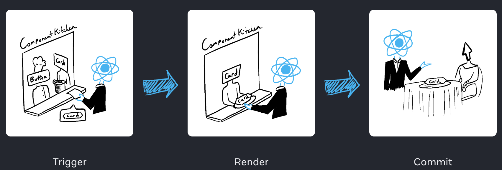

# React.dev-docs-15-렌더링 그리고 커밋

[REACT 학습하기 > 상호작용성 더하기 > 렌더링 그리고 커밋](https://ko.react.dev/learn/render-and-commit)

## Goal

컴포넌트를 화면에 표시하기 이전에 React에서 **렌더링**을 해야 함.  
React 렌더링의 동작 과정에 대한 이해.

- React에서 렌더링의 의미
- React가 컴포넌트를 언제, 왜 렌더링 하는지
- 화면에 컴포넌트를 표시하는 단계
- 렌더링이 항상 DOM 업데이트를 하지 않는 이유

주방에서 요리사가 컴포넌트를 재료로 맛있는 요리를 한다고 상상해보기.  
이 시나리오에서 React는 고객들의 요청을 받고 주문을 가져오는 웨이터로 가정.  
이 과정에는 UI를 요청하고 제공하는 세 가지 단계가 존재함.

1. 렌더링 `트리거` (손님의 주문을 주방으로 전달)
2. 컴포넌트 `렌더링` (주방에서 주문 준비하기)
3. DOM에 `커밋` (테이블에 주문한 요리 내놓기)

 

## 1단계: 렌더링 트리거

컴포넌트 렌더링이 일어나는 데에는 두 가지 이유가 존재함.

1. 컴포넌트의 **초기 렌더링인 경우**
2. 컴포넌트의 **state가 업데이트된 경우**

### 초기 렌더링

- 앱 시작 시 루트 컴포넌트에서 최초의 렌더링이 시작됨.
- React가 컴포넌트 트리를 따라 내려가며 초기 UI를 준비함.

### State 업데이트 시 리렌더링

- 사용자가 입력을 하거나 버튼을 누르면 state가 업데이트됨.
- `set` 함수를 통해 상태를 업데이트하여 추가적인 렌더링 트리거 가능.
- React는 해당 state와 관련된 컴포넌트들을 리렌더링 대상으로 표시함.
- 컴포넌트의 상태를 업데이트하면 자동으로 렌더링 대기열에 추가 됨.
  - 중요 개념.!!
  - react 의 상태 관리의 기본 동작 개념
  - (이것은 레스토랑의 손님이 첫 주문 이후에 갈증이나 배고픔의 상태에 따라 차, 디저트 등의 메뉴를 주문하는 것으로 상상해 볼 수 있음.)

## 2단계: React 컴포넌트 렌더링

- 리렌더링은 **컴포넌트 함수를 다시 호출**하여 새로운 JSX를 생성하는 과정.
- 이 과정은 React 내부에서 수행되며, DOM에 바로 반영되지 않음.
  - 다음 단계인 커밋 단계까지는 해당 정보로 아무런 작업도 수행하지 않음.
- 렌더링 결과물이 이전과 동일하다면 React는 효율적으로 DOM을 건드리지 않을 수 있음.

> **주의하세요!**  
> 렌더링은 항상 **순수한 계산**이어야 한다.
>
> 같은 props와 state가 주어지면 항상 동일한 결과를 반환해야 하며, 외부 값을 직접 변경해서는 안 된다.
>
> 이전의 state를 변경해서는 안된다. 렌더링 전에 존재했던 객체나 변수를 변경해서는 안 된다. (누군가의 주문이 다른 사람의 주문을 변경해서는 안 된다!)

#### 성능 최적화

- React는 Virtual DOM을 활용해 이전 렌더링 결과와 새 렌더링 결과를 비교(`diffing`).
- 실제 변경된 부분만 DOM에 반영하기 때문에 성능적으로 효율적이다.

## 3단계: React가 DOM에 변경사항을 커밋

- React는 렌더링 결과를 기반으로 실제 DOM을 업데이트한다.
- 변경된 부분만 선택적으로 반영하기 때문에 빠르고 효율적이다.
- 이 시점에서 브라우저 화면이 실제로 바뀐다.

## 에필로그: 브라우저 페인트

- DOM 업데이트 이후, 브라우저는 새롭게 반영된 DOM 트리를 화면에 **페인트(paint)** 한다.
- 이 과정은 React가 아닌 브라우저 렌더링 엔진이 담당한다.

## 요약

- React 앱의 모든 화면 업데이트는 세 단계로 이루어진다.
  1. 트리거
  2. 렌더링
  3. 커밋
- Strict Mode를 사용하여 컴포넌트에서 실수를 조기에 발견할 수 있다.
- 렌더링 결과가 이전과 동일하다면 React는 DOM을 건드리지 않는다.

## 인사이트

- 렌더링 과정을 **트리거 → 렌더링 → 커밋 → 페인트**로 구분하여 이해하면 React 동작 흐름이 명확히 보인다.
- Virtual DOM을 통한 diffing은 “필요한 부분만 바꾼다”는 효율성을 제공하며, 이는 React 성능 최적화의 핵심 원리다.
  - React의 `diffing` 알고리즘 및 렌더링 과정, `Fiber`에 대해 공부하면, 좀 더 자세한 동작 원리를 심도있게 이해할 수 있다.
- 렌더링이 곧 DOM 업데이트가 아니라는 점을 분리해서 이해하는 것이 실무에서 성능 튜닝과 디버깅에 중요한 사안.
