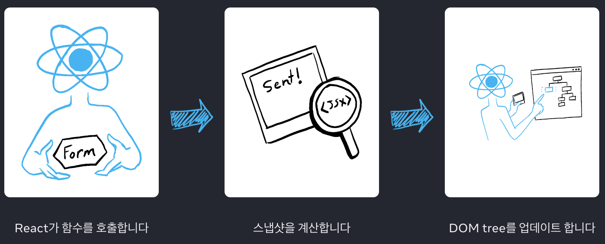
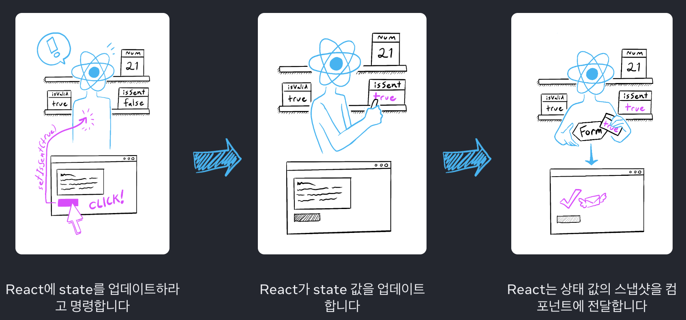

# React.dev-docs-16-스냅샷으로서의 State

[REACT 학습하기 > 상호작용성 더하기 > 스냅샷으로서의 State](https://ko.react.dev/learn/state-as-a-snapshot)

## Goal

State 변수는, 읽고 쓸 수 있는 일반 자바스크립트 변수처럼 보일 수 있음.  
하지만 state는 **_스냅샷_** 처럼 동작함.  
state 변수를 설정하여도, 이미 가지고 있는 state 변수는 변경되지 않고, 대신 **리렌더링** 이 발동 됨.

- state 설정으로 리렌더링이 동작하는 방식
- state 업데이트 시기 및 방법
- state를 설정한 직후에 state가 업데이트되지 않는 이유
- 이벤트 핸들러가 state의 “스냅샷”에 접근하는 방법

## state를 설정하면 렌더링이 동작합니다

- `setState`는 값을 직접 바꾸는 것이 아니라 **React에게 새로운 렌더링을 요청**하는 것이다.
- 렌더링이 실행된 이후에야 새로운 state가 반영된다.
- 따라서 `setState` 직후에 state를 읽으면 **이전 값(스냅샷)** 이 반환된다.

React가 컴포넌트를 다시 렌더링할 때.

1. React가 함수를 다시 호출합니다.
2. 함수가 새로운 JSX 스냅샷을 반환합니다.
3. 그러면 React가 함수가 반환한 스냅샷과 일치하도록 화면을 업데이트합니다.

- 컴포넌트의 메모리로써 state는 함수가 반환된 후 사라지는 일반 변수와 다르다.
- state는 실제로 함수 외부에 마치 선반에 있는 것처럼 React 자체에 “존재" 한다.
- React가 컴포넌트를 호출하면 특정 렌더링에 대한 state의 스냅샷을 제공한다.
- 컴포넌트는 해당 렌더링의 state 값을 사용해 계산된 새로운 props 세트와 이벤트 핸들러가 포함된 UI의 스냅샷을 JSX에 반환한다.

## 렌더링은 그 시점의 스냅샷을 찍습니다.

- React는 각 렌더링 시점에 state의 값을 “고정된 스냅샷”으로 제공한다.
- 한 렌더링에서 사용되는 state와 이벤트 핸들러는 **변하지 않는 값**을 바라본다.
- 새로운 렌더링이 발생하면, 그 렌더링의 시점에서 최신 state 스냅샷을 제공한다.

## 시간 경과에 따른 State

- 이벤트가 여러 번 발생하면, 각 시점마다 **해당 렌더링 시점의 state**를 기준으로 동작한다.
- 과거에 생성된 이벤트 핸들러는 여전히 **자신이 만들어졌던 렌더링의 state 값**을 갖는다.
- 이로 인해 `setState` 직후에 새로운 값이 보이지 않는 것처럼 보일 수 있다.
- 그러나 React는 일관성을 위해 이러한 스냅샷 모델을 따른다.

## 요약

- state를 설정하면 React는 새 렌더링을 요청한다.
- React는 컴포넌트 외부에서 선반에 보관하듯 state를 저장하며, 각 렌더링은 해당 시점의 state 스냅샷을 가진다.
- useState를 호출하면 React는 스냅샷을 제공한다.
- 변수와 이벤트 핸들러는 렌더링 사이에서 살아남지 않는다.
- 모든 렌더링은 React가 제공한 state 스냅샷을 기준으로 동작한다.
- 과거의 이벤트 핸들러는 자신이 만들어진 렌더링 당시의 state를 갖는다.

## 인사이트

- React의 state를 “변수”로 착각하면, `setState` 직후 값이 업데이트되지 않아 혼란스러울 수 있다. 그러나 React는 일관성을 위해 **렌더링 단위로 state를 고정**한다. React 공부 초반, 이 동작에 대해 이해하기 위해 힘 썼던 기억이난다.
- 이 특성은 동시성 모드(Concurrent Mode)나 비동기 렌더링 환경에서 안전하게 동작할 수 있도록 설계된 원리와 연결된다.
- 이벤트 핸들러가 과거 state를 바라보는 것은 “버그”가 아니라 React의 설계 원리다. 이 개념을 명확히 이해하면 불필요한 디버깅 시간을 줄일 수 있다.
- 실무에서는 `setState`에 함수형 업데이트(`setState(prev => ...)`)를 활용하여 이러한 스냅샷 특성을 올바르게 다룰 수 있다.
