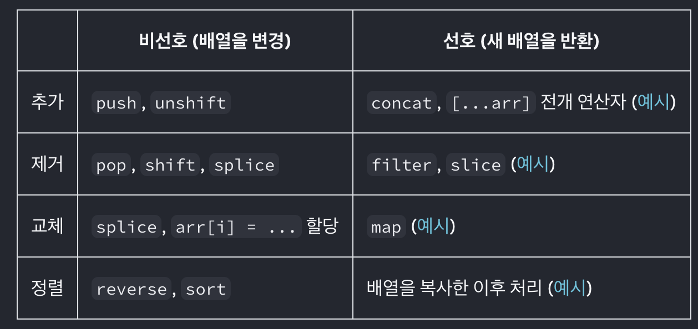

# React.dev-docs-19-배열 State 업데이트하기

[REACT 학습하기 > 상호작용성 더하기 > 배열 State 업데이트하기](https://ko.react.dev/learn/updating-arrays-in-state)

## Goal

배열은 JavaScript에서는 변경이 가능하지만, state로 저장할 때에는 변경할 수 없도록 처리해야 한다.

객체와 마찬가지로, state에 저장된 배열을 업데이트하고 싶을 때에는,  
새 배열을 생성(혹은 기존 배열의 복사본을 생성)한 뒤, 이 새 배열을 state로 두어 업데이트해야 한다.

- React state에서 배열의 항목을 추가, 삭제 또는 변경하는 방법
- 배열 내부의 객체를 업데이트하는 방법
- Immer로 덜 반복해서 배열을 복사하는 방법

## 변경하지 않고 배열 업데이트하기

아래는 **비선호(배열을 직접 변경)** vs **선호(새 배열 반환)** 방식의 비교이다.



> **주의하세요!**  
> `slice` 와 `splice` 는 이름이 비슷하지만 몹시 다르다.
>
> - `slice`: 배열 또는 배열의 일부를 복사한다. (불변성 보장 O)
> - `splice`: 배열을 직접 변경한다. (불변성 보장 X)  
>   React state 관리에서는 `slice`를 훨씬 더 자주 사용하게 된다.

### 배열에 항목 추가하기

```js
setArtists([...artists, { id: nextId++, name: name }]);
```

### 배열에서 항목 제거하기

```js
setArtists(artists.filter((a) => a.id !== artist.id));
```

### 배열 변환하기

```js
setArtists(artists.map((a) => (a.id === artist.id ? { ...a, name: '새 이름' } : a)));
```

### 배열 내 항목 교체하기

```js
setItems(items.map((item, i) => (i === index ? newItem : item)));
```

### 배열에 항목 삽입하기

```js
setItems([...items.slice(0, index), newItem, ...items.slice(index)]);
```

### 배열에 기타 변경 적용하기

- `reverse()`나 `sort()`와 같은 메서드는 원본 배열을 변경하므로 사용 시 주의.

- 사용 전 반드시 복사본을 생성해야 한다:

```js
setList([...list].reverse());
setList([...list].sort((a, b) => a.value - b.value));
```

## 배열 내부의 객체 업데이트하기

- 배열 내부 객체 또한 불변성을 지켜야 한다.
- 전개 연산자와 `map()`을 조합하여 개별 객체를 복사한 후 변경한다.

```js
setTasks(tasks.map((t) => (t.id === task.id ? { ...t, done: !t.done } : t)));
```

- 중첩된 state를 업데이트할 때, 업데이트하려는 지점부터 최상위 레벨까지의 복사본을 만들어야 한다.

### Immer로 간결한 업데이트 로직 작성하기

- Immer를 사용하면 직접 변경하듯 작성해도 내부적으로는 불변성이 보장된다.
  - 원본 `state`를 변경하는 것이 아니라, Immer에서 제공하는 특수 `draft 객체`를 변경하기 때문.
  - 내부적으로 Immer는 항상 draft에서 수행한 변경 사항에 따라 처음부터 다음 state를 구성

```js
updateTasks((draft) => {
  const task = draft.find((t) => t.id === id);
  task.done = !task.done;
});
```

## 요약

- 배열을 state로 만들 수 있지만 직접 변경해서는 안 된다.
- 변경 대신 새로운 배열을 생성하고 state를 업데이트해야 한다.
- `[...arr, newItem]`으로 새 항목 추가, `filter()`와 `map()`으로 항목 삭제/변경 가능.
- 정렬이나 뒤집기 같은 경우 반드시 복사본을 만들어 적용해야 한다.
- 중첩 객체와 마찬가지로 불변성 유지가 필수이며, 반복되는 작업은 `Immer`로 단순화할 수 있다.

## 인사이트

- 언제나!React state에서는 불변성 유지가 필수이다.
