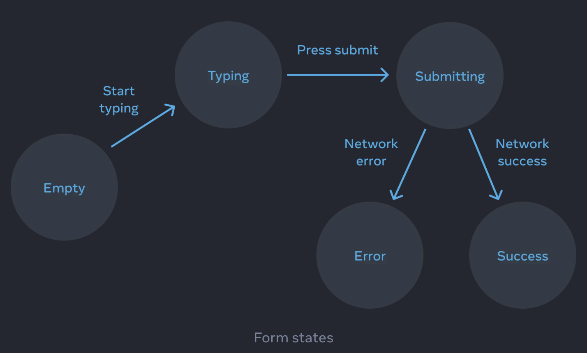

# React.dev-docs-20-State를 사용해 Input 다루기

[REACT 학습하기 > STATE 관리하기 > State를 사용해 Input 다루기](https://ko.react.dev/learn/reacting-to-input-with-state)

## Goal

React는 **선언적인 방식**으로 UI를 조작한다.  
개별적은 UI를 직접 조작하는 것 대신, 컴포넌트 내부에 여러 **state**를 묘사하고 _사용자의 입력에 따라 **state**를 변경한다_.

- 명령형 UI 프로그래밍이 아닌 선언형 UI 프로그래밍을 하는 방법
- 컴포넌트에 들어갈 수 있는 다양한 시각적 state를 열거하는 방법
- 코드에서 다른 시각적 state 간의 변경을 트리거 하는 방법

## 선언형 UI와 명령형 UI 비교

- **명령형 UI**: DOM API를 직접 제어해 요소를 조작한다.  
  예: `document.getElementById().style.color = 'red';`
- **선언형 UI**: UI의 최종 상태를 묘사하면 React가 DOM 업데이트를 수행한다.  
  예: `return 
Hello
;`
- React에서는 직접 UI를 조작할 필요가 없다.
  - 컴포넌트를 직접 활성화 하거나, 비활성화 하거나, 보여주거나, 숨길 필요가 없다.
  - **_대신, 무엇을 보여주고 싶은지 선언하기만 하면 된다._**

> 택시를 탄다고 생각해 봅시다. 운전기사에게 어디서 꺾어야 할지 알려주는게 아니라 **가고 싶은 곳을 말한다**고 생각해 보세요. 당신을 거기까지 데려다주는 것은 운전기사의 일이고 운전기사는 어쩌면 당신이 몰랐던 지름길을 알고 있을지도 모릅니다!

---

## UI를 선언적인 방식으로 생각하기

React처럼 생각하는 방법  
UI를 React에서 다시 구현하는 과정

1. 컴포넌트의 다양한 **시각적 state**를 확인하세요.
2. 무엇이 **state 변화를 트리거**하는지 알아내세요.
3. **useState**를 사용해서 메모리의 state를 표현하세요.
4. **불필요한 state 변수를 제거**하세요.
5. state 설정을 위해 이벤트 **핸들러를 연결**하세요.

### 첫 번째: 컴포넌트의 다양한 시각적 state 확인하기

- 입력 필드, 버튼, 드롭다운 등 다양한 시각적 상태를 명확히 나열한다.
- 예: 입력값 없음 → 입력 중 → 제출 완료

> **많은 시각적 state를 한 번에 보여주기**
>
> 각 상태를 미리 정의하고 이를 기반으로 UI를 설계하면 버그를 줄이고 구조를 명확히 할 수 있다.

### 두 번째: 무엇이 state 변화를 트리거하는지 알아내기

- 사용자 입력, 버튼 클릭, 네트워크 응답 등이 state 변화를 일으킨다.
  - 휴먼 인풋과 컴퓨터 인풋 존재
- **state 전환 조건**을 명확히 파악해야 한다.

### 세 번째: 메모리의 state를 useState로 표현하기

- React의 `useState` 훅을 사용하여 현재 상태를 변수로 관리한다.
- `const [value, setValue] = useState('')`

### 네 번째: 불필요한 state 변수를 제거하기

- 모든 시각적 요소가 state일 필요는 없다.
- 계산 가능하거나 파생 가능한 값은 state에서 제거해야 한다.
- **_state가 사용자에게 유효한 UI를 보여주지 않는 경우를 방지할 것!_**
  - 중복 state제거, 필수만 남기기
  1. state가 **역설**을 일으키지는 않는가?
     - `isTyping`과 `isSubmitting`이 동시에 `true`일 수는 없음
     - '`typing`', '`submitting`', '`success`'을 하나의 status로 합칠 수 있다.
  2. 다른 state 변수에 이미 **같은 정보**가 담겨 있지는 않는가?
     - `isEmpty`와 `isTyping`은 동시에 `true`가 될 수 없다.  
       이를 각각의 state 변수로 분리하면 싱크가 맞지 않거나 버그가 발생할 위험 존재함.
  3. 다른 변수를 **뒤집었을 때** 같은 정보를 얻을 수 있진 않는가?
     - `isError`는 `error !== null`로도 대신 확인할 수 있다.

> **Reducer를 사용하여 “불가능한” state 제거**
>
> 복잡한 상태 전환은 reducer 패턴을 도입해 관리하면 “동시에 발생할 수 없는 상태”를 피할 수 있다.

### 다섯 번째: state 설정을 위해 이벤트 핸들러를 연결하기

- 입력 필드 → `onChange` 이벤트에서 `setState` 호출
- 버튼 클릭 → `onClick` 이벤트에서 `setState` 호출

---

## 요약

- **선언형 프로그래밍**은 UI를 직접 조작(명령형)하지 않고, **시각적 state**를 정의하고 묘사하는 것이다.
- 컴포넌트 개발 시 단계별 접근 방식:
  1. 모든 시각적 state 확인
  2. state 변화를 트리거하는 원인 파악 - 휴면/컴퓨터
  3. `useState`로 state 모델링
  4. 불필요한 state 제거 - 버그와 모순 피하기
  5. 이벤트 핸들러 연결 - state 설정용

---

## 인사이트

- 선언적인 코드 작성에 대해 읽었던 글이 생각난다.
  - [선언적인 코드 작성하기, 박서진](https://toss.tech/article/frontend-declarative-code)
